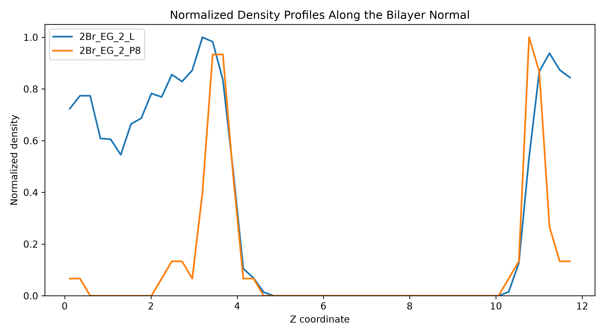
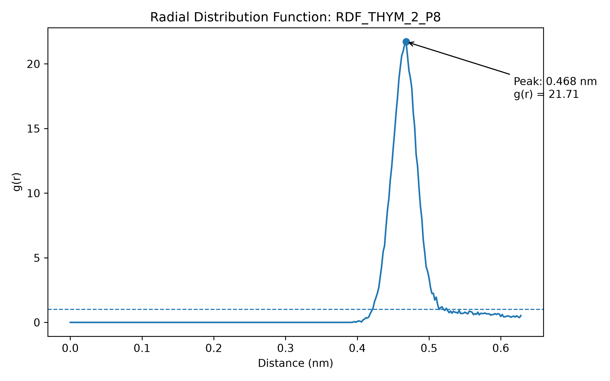
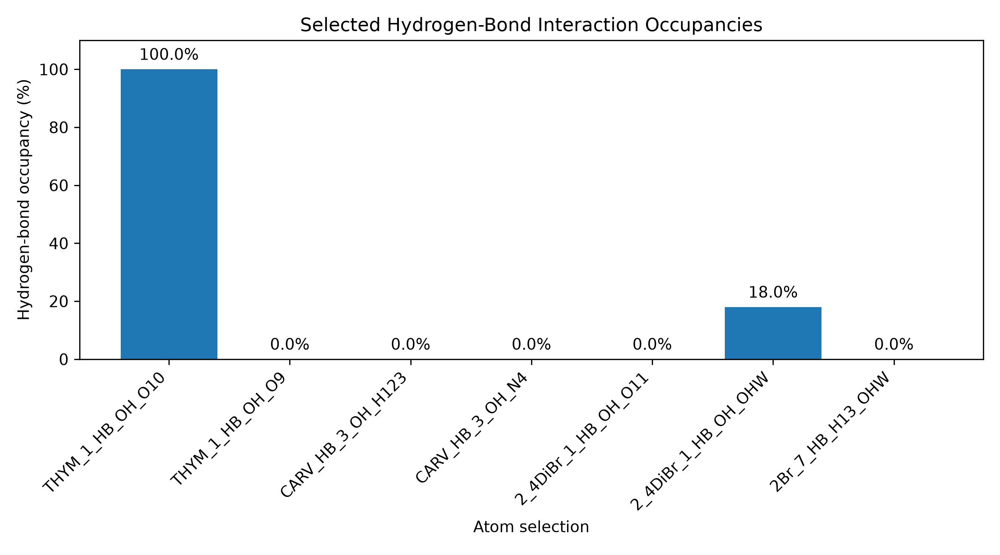
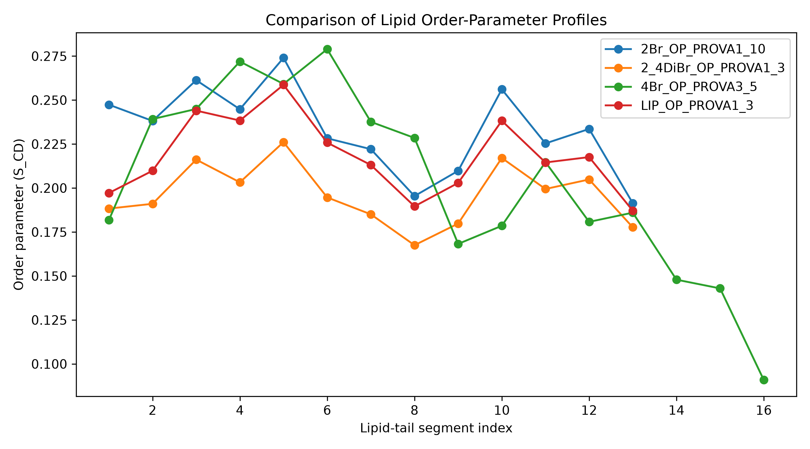

# Molecular Dynamics Analysis Portfolio

**Atomistic molecular dynamics of thymol-derived compounds interacting with neutral and charged lipid membranes**

This repository presents a computational biophysics case study based on my MSc Biotechnology thesis at the University of Rome Tor Vergata.

The research investigated how thymol and structurally related derivatives interact with model lipid membranes using atomistic molecular dynamics.

The portfolio combines selected molecular dynamics analysis outputs with new Python workflows developed to make the data easier to reproduce, visualize, compare, and explore.

---

## Project at a Glance

| Category | Details |
|---|---|
| **Research area** | Molecular dynamics, membrane biophysics, computational biotechnology |
| **Simulation software** | GROMACS 2022.5 |
| **Force field** | GROMOS 54A7 |
| **Ligand parameterization** | Automated Topology Builder (ATB) |
| **Membrane models** | Neutral POPC and charged POPE/POPG bilayers |
| **Compounds** | Thymol, carvacrol, thymol acetate, 2-bromothymol, 4-bromothymol, 2,4-dibromothymol |
| **Simulation approach** | Atomistic molecular dynamics with a minimum-bias / minimally biased membrane-ligand workflow |
| **Computing environment** | Linux and high-performance computing |
| **Visualization** | VMD and ChimeraX |
| **Portfolio analysis** | Python, Matplotlib, CSV-based numerical summaries |
| **Version control** | Git and GitHub |

---

## Research Question

The project examined how structural modifications of thymol influence:

- membrane localization
- interfacial stabilization
- hydrogen bonding
- lipid packing
- membrane structural response
- spatial relationships between ligands and lipid components

Two membrane environments were studied:

- **POPC**, representing a neutral phosphatidylcholine membrane model
- **POPE/POPG**, representing a negatively charged bacterial-like membrane model

The six compounds investigated were:

1. thymol
2. carvacrol
3. thymol acetate
4. 2-bromothymol
5. 4-bromothymol
6. 2,4-dibromothymol

---

## My Contribution

My work included preparing, executing, checking, and analyzing multiple atomistic membrane-ligand molecular dynamics systems.

Practical tasks included:

- constructing membrane-ligand simulation boxes
- applying energy-minimization and equilibration workflows
- running GROMACS in Linux environments
- using high-performance computing resources for production simulations
- visually inspecting membrane assembly and ligand behavior
- identifying unsuitable systems and rebuilding them when required
- performing trajectory and interaction analyses
- generating structural visualizations using VMD and ChimeraX
- interpreting simulation outputs in the context of membrane biophysics

The molecular dynamics analyses included:

- ligand-membrane distance measurements
- radial distribution functions
- hydrogen-bond analysis
- density profiles
- lipid-tail order parameters
- RMSD
- membrane headgroup-related analyses

The Python scripts in this repository are **portfolio and reproducibility extensions** developed around selected processed molecular dynamics outputs. They are not presented as the original thesis analysis scripts.

---

## Selected Results

The repository includes reproducible Python workflows built around selected molecular dynamics analysis outputs.

The figures below show representative examples.

### Ligand-Membrane Spatial Distribution

Normalized density profiles allow components with very different absolute density magnitudes to be compared according to spatial position and profile shape.



In this selected 2-bromothymol dataset, the analyzed components show distinct distributions along the bilayer-normal coordinate. Normalization emphasizes relative peak locations and profile shapes rather than absolute density magnitude.

---

### Radial Distribution Function

Radial distribution functions were used to examine preferred distances between selected molecular groups.



The selected thymol-P8 RDF contains a pronounced maximum near **0.47 nm**, indicating enrichment at this separation.

RDF peaks are interpreted as structural distance preferences and are not treated as direct proof of molecular binding.

---

### Hydrogen-Bond Occupancy

Selected ligand-membrane and ligand-water hydrogen-bond interactions were analyzed using frame-based occupancy.



The selected interactions range from persistent to intermittent or absent depending on the donor-acceptor pair.

These values represent specific atom selections and should not be interpreted as a simple overall ranking of compound binding strength.

---

### Lipid-Tail Ordering

Segmental lipid order parameters provide information about orientational ordering along selected lipid tails.



The selected profiles show variation in lipid-tail ordering between analyzed systems.

Absolute comparisons are interpreted cautiously when lipid species, atom selections, or segment definitions differ.

---

## Analysis Portfolio

The repository currently contains reproducible workflows for:

| Analysis | Portfolio Workflow |
|---|---|
| **RDF** | Plot RDF profiles and identify strongest positive peaks |
| **RMSD** | Plot trajectories and calculate descriptive late-window statistics |
| **Hydrogen bonds** | Calculate interaction-specific occupancy and compare selected interactions |
| **Lipid order parameters** | Plot and compare segmental S_CD profiles |
| **Headgroup distributions** | Detect global and local distribution peaks |
| **Density profiles** | Compare spatial density profiles along the bilayer-normal coordinate |
| **Normalized density** | Compare profile shape and spatial position independent of absolute magnitude |

Detailed scientific interpretation is available in:

[`analysis/README.md`](analysis/README.md)

Instructions for running the Python tools are available in:

[`scripts/README.md`](scripts/README.md)

## Interactive Analysis Walkthrough

A Jupyter notebook is included to demonstrate one analysis from processed GROMACS output through numerical interpretation and visualization.

### RDF: Thymol - P8

[`notebooks/rdf_analysis_walkthrough.ipynb`](notebooks/rdf_analysis_walkthrough.ipynb)

The notebook demonstrates:

- reading a GROMACS `.xvg` file
- removing metadata lines
- extracting RDF coordinates and values
- identifying the strongest RDF peak
- locating the peak at approximately **0.468 nm**
- visualizing the RDF directly in the notebook
- interpreting the result with appropriate scientific caution

The notebook complements the reusable Python scripts by showing the analysis step-by-step in an interactive format.

---

## Molecular Dynamics Workflow

A simplified overview of the research workflow is:

```text
System construction
        |
        v
Solvation and ion addition
        |
        v
Energy minimization
        |
        v
Anisotropic / semi-isotropic MD preparation
        |
        v
Production molecular dynamics
        |
        v
Trajectory quality control
        |
        v
Structural and interaction analysis
        |
        v
Scientific interpretation
```

The membrane-ligand systems were simulated using GROMACS in a Linux-based computational environment.

Large production calculations were performed using high-performance computing resources.

---

## Repository Structure

```text
molecular-dynamics-analysis/
|
|-- README.md
|-- requirements.txt
|-- .gitignore
|
|-- analysis/
|   |-- README.md
|   |-- density-profiles/
|   |-- headgroup-analysis/
|   |-- hydrogen-bonds/
|   |-- order-parameters/
|   |-- rdf/
|   `-- rmsd/
|
|-- docs/
|   |-- analysis-methods.md
|   `-- simulation-workflow.md
|
|-- figures/
|
`-- scripts/
    |-- README.md
    |-- plot_rdf.py
    |-- plot_rmsd.py
    |-- compare_rmsd.py
    |-- plot_hbonds.py
    |-- compare_hbonds.py
    |-- plot_order_parameter.py
    |-- compare_order_parameters.py
    |-- compare-distribution.py
    |-- compare_density_profiles.py
    `-- compare_normalized_density.py
```

---

## Reproducibility

Clone the repository:

```bash
git clone https://github.com/Arshiya-Parvizi/molecular-dynamics-portfolio.git
```

Enter the repository:

```bash
cd molecular-dynamics-portfolio
```

Install the Python dependency:

```bash
python -m pip install -r requirements.txt
```

Example RDF analysis:

```bash
python scripts/plot_rdf.py analysis/rdf/RDF_THYM_2_P8.xvg
```

Example RMSD comparison:

```bash
python scripts/compare_rmsd.py analysis/rmsd/2Br_POPC_RMSD_10.xvg analysis/rmsd/2Br_POPC_RMSD_7.xvg
```

Example normalized density comparison:

```bash
python scripts/compare_normalized_density.py analysis/density-profiles/2Br_EG_2_L.xvg analysis/density-profiles/2Br_EG_2_P8.xvg
```

Generated figures are written to:

```text
figures/
```

Numerical summaries produced by comparison scripts are stored as CSV files inside the relevant analysis directories.

---

## Technical Skills Demonstrated

`GROMACS` · `Molecular Dynamics` · `Linux` · `HPC` · `Python` · `Matplotlib` · `VMD` · `ChimeraX` · `Git` · `GitHub` · `Scientific Data Analysis` · `Membrane Biophysics`

---

## Data Availability

This repository contains a selected subset of processed molecular dynamics outputs intended to demonstrate the analytical workflow.

Large simulation and trajectory files are intentionally excluded, including formats such as:

```text
.xtc
.trr
.tpr
.cpt
.edr
.gro
```

Selected `.xvg` analysis outputs are included where appropriate.

This keeps the repository lightweight while preserving enough data to demonstrate:

- scientific analysis
- Python processing
- visualization
- quantitative comparison
- reproducibility

---

## Scientific Scope

Molecular dynamics models are simplified representations of biological membranes.

The results in this repository should therefore be interpreted as molecular-scale structural observations within the simulated systems rather than direct measurements of biological activity.

Individual observables such as RDF, RMSD, hydrogen bonding, density, or order parameters are interpreted together rather than being used as isolated proof of mechanism.

---

## Thesis Context

This portfolio is based on work associated with the MSc thesis:

**Investigation of the Mechanism of Action of Thymol and its derivatives on neutral and charged membranes with a non-biased approach using Molecular Dynamics**

Master of Science in Biotechnology  
Università degli Studi di Roma Tor Vergata  
Academic year 2025/2026